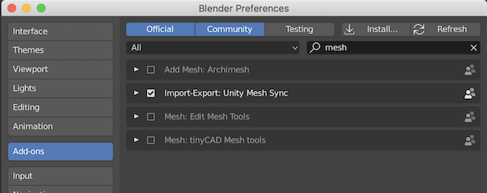

# Installation

1. [Maya](#maya)
1. [Blender](#blender)

## Maya

1. Autodesk のライセンスのため, [手動のビルド](../en/BuildDCCPlugins.md) (現在英語のみ) が必要です。
1. プラグインをコピーする
   - Windows:   
     `MAYA_APP_DIR` の環境変数が設定されている場合はそこにコピーする。  
     ない場合は `%USERPROFILE%\Documents\maya` ( Explorer のアドレスバーへコピペで直行) に *modules* ディレクトリをそのままコピーする。
   - Mac:   
     `/Users/Shared/Autodesk/modules/maya` に *UnityMeshSync* ディレクトリと *UnityMeshSync.mod* ファイルをコピーする。
   - Linux:   
     `~/maya/<maya_version>` に *modules* ディレクトリをそのままコピーする。  

1. Maya を起動し、Windows -> Settings/Preferences -> Plug-in Manager を開く。
1. MeshSyncClient の Loaded にチェックを入れてプラグインを有効化する。
1. シェルフ UI に UnityMeshSync が追加されているはずです。  
   歯車アイコンで設定メニューを開き、MeshSync と色々遊んでみましょう。

## Blender
  

1. 使っている MeshSync と同じバージョンの Blender プラグインを[リリースページ](https://github.com/Unity-Technologies/MeshSyncDCCPlugin/releases)からダウンロードする 
1. Blender のバージョンによって、インストールする方法が少々違います
   - Blender 2.79:
     * File -> User Preferences -> Add-ons を開く
     * 画面下部の "Install Add-on from file" を押し、プラグインの zip ファイルを指定する
     * "Import-Export: Unity Mesh Sync" が追加されたのを確認する        
   - Blender 2.80 以降:
     * Edit -> User Preferences を開く 
     * ウィンドウの右上の "Install" をクリックし、プラグインの zip ファイルを指定する
     * "Import-Export: Unity Mesh Sync" が "Add-ons" タブに追加されたのを確認する
1. "Import-Export: Unity Mesh Sync" をチェックし、有効化する 
   

> 使っている MeshSync のバージョンに該当するプラグインが[リリースページ](https://github.com/Unity-Technologies/MeshSyncDCCPlugin/releases)に見つからない場合、 
  [手動のビルド](../en/BuildDCCPlugins.md) (現在英語のみ) を参考にし、ビルドします。
  
### Caveat

Blender のプラグインをインストールする時、古いバージョンのプラグインがあれば、それを事前にアンインストールしておく必要があります。  
アンインストールの手順：

1. Add-ons メニューから "Import-Export: Unity Mesh Sync" を選択
1. "Remove" ボタンをクリック
1. Blender を再起動 
  
