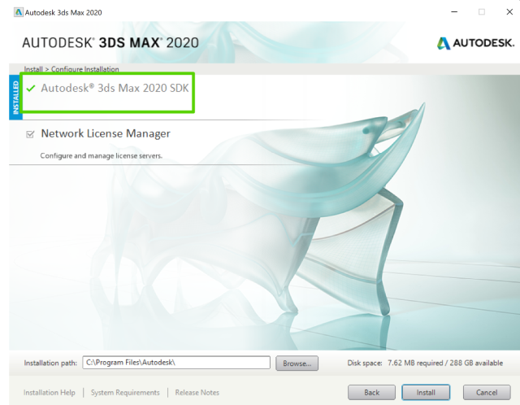

# Setting Up DCC Tools for Building Plugins

Please refer to the following sections to setup each DCC tool.

> Unless specified by [MakeOptionalArguments](MakeOptionalArguments.md), 
the build script will build MeshSync plugins for [all supported DCC tools](../../README.md), 
and therefore all supported DCC tools below have to be set up.

## Maya

Based on the version of [Maya](https://www.autodesk.com/products/maya/overview), set the following environment variable:
* `MAYA_SDK_<MAYA_VERSION>` : 
  where the [SDK or devkit](https://www.autodesk.com/developer-network/platform-technologies/maya) is installed.

> On Linux, no setup is necessary if Maya is installed in the default location.

For example in MacOS:
``` 
export MAYA_SDK_2017=/Applications/Autodesk/maya2017/Maya.app/Contents
export MAYA_SDK_2018=/path/to/maya/sdk/2018
export MAYA_SDK_2019=/path/to/maya/sdk/2019
export MAYA_SDK_2020=/path/to/maya/sdk/2020
``` 

> **Maya 2017 requires the path to the full product installation**, instead of just the devkit.


## 3ds Max 



No setup is necessary if the SDK is installed using [3ds Max](https://www.autodesk.com/products/3ds-max/overview)
install application.  
However, if the SDK was downloaded directly from [3ds Max Developer Center](https://www.autodesk.com/developer-network/platform-technologies/3ds-max) 
on the Internet, then we need to set the following environment variable:
* `ADSK_3DSMAX_SDK_<3DSMAX_VERSION>` : where 3ds Max is installed.

## MotionBuilder

Based on the version of [MotionBuilder](https://www.autodesk.com/products/motionbuilder/overview), set the following environment variable:
* `MOTIONBUILDER_SDK_<MOTIONBUILDER_VERSION>` : where MotionBuilder is installed.

> On Linux, no setup is necessary if MotionBuilder is installed in the default location.


